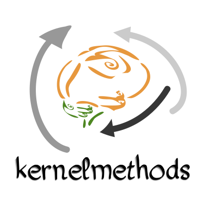
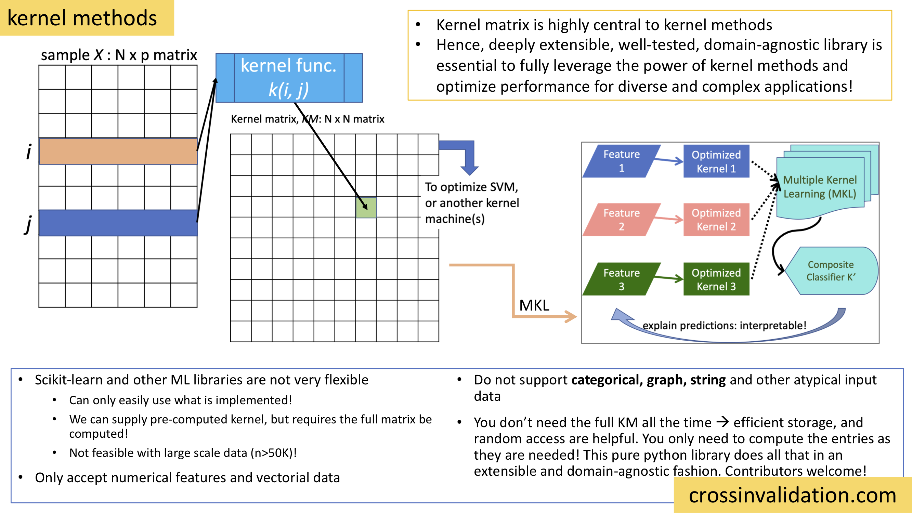

==========================
Kernel methods and classes
==========================

Docs: https://raamana.github.io/kernelmethods/

Demo notebooks (no setup required) :

.. image:: https://mybinder.org/badge_logo.svg
 :target: https://mybinder.org/v2/gh/raamana/kernelmethods/master?filepath=demo_tutorials%2Fdemo_kernelmethods.ipynb

----

.. image:: https://img.shields.io/pypi/v/kernelmethods.svg
        :target: https://pypi.python.org/pypi/kernelmethods

.. image:: https://img.shields.io/travis/raamana/kernelmethods.svg
        :target: https://travis-ci.org/raamana/kernelmethods

.. image:: https://coveralls.io/repos/github/raamana/kernelmethods/badge.svg?branch=master
    :target: https://coveralls.io/github/raamana/kernelmethods?branch=master

kernelmethods
-------------

``kernelmethods`` is a pure python library defining modular classes that provides basic kernel methods, such as computing various kernel functions on a given sample (N points of dimension p) as well as provides an intuitive interface for advanced functionality such as composite and hyper kernels. This library fills an important void in the ever-growing python-based machine learning ecosystem, where users can only use predefined kernels and are not able to customize or extend them for their own applications, that demand great flexibility owing to their diversity and need for better performing kernel. This library defines the ``KernelMatrix`` class that is central to all the kernel methods and machines. As the ``KernelMatrix`` class is a key bridge between input data and the various kernel learning algorithms, it is designed to be highly usable and extensible to different applications and data types. Besides being able to apply basic kernels on a given sample (to produce a ``KernelMatrix``), this library provides various kernel operations, such as normalization, centering, product, alignment evaluation, linear combination and ranking (by various performance metrics) of kernel matrices.

In addition, we provide several convenient classes, such as ``KernelSet`` and ``KernelBucket`` for easy management of a large collection of kernels.  Dealing with a diverse configuration of kernels is necessary for automatic kernel selection and optimization in applications such as Multiple Kernel Learning (MKL) and the like.

In addition to the common numerical kernels such as the Gaussian and Polynomial kernels, we designed this library to make it easy to develop categorical, string and graph kernels, with the same attractive properties of intuitive and highly-testable API. In addition to providing native implementation of non-numerical kernels, we aim to provide a deeply and easily extensible framework for arbitrary input data types, such as sequences, trees and graphs etc, via data structures such as ``pyradigm``.

Moreover, drop-in ``Estimator`` classes are provided, called ``KernelMachine``, offering the power of ``SVM`` for seamless usage in the ``scikit-learn`` ecosystem. Another useful class is called ``OptimalKernelSVR`` which finds the most optimal kernel func for a given sample, and trains the SVM using the optimal kernel.

Docs
----

https://raamana.github.io/kernelmethods/

Demo notebooks:

.. image:: https://mybinder.org/badge_logo.svg
 :target: https://mybinder.org/v2/gh/raamana/kernelmethods/master?filepath=demo_tutorials%2Fdemo_kernelmethods.ipynb

Note
----

The software is beta. All types of contributions are greatly welcome.

Dedication
-----------

This library is dedicated to `The Concert for Bangladesh <https://en.wikipedia.org/wiki/The_Concert_for_Bangladesh>`_, George Harrison and Pandit Ravi Shankar, who moved me immensely with their empathy and kindness, by organizing the first benefit concert ever to raise international awareness and funds for Bangladesh's liberation war in 1971.

